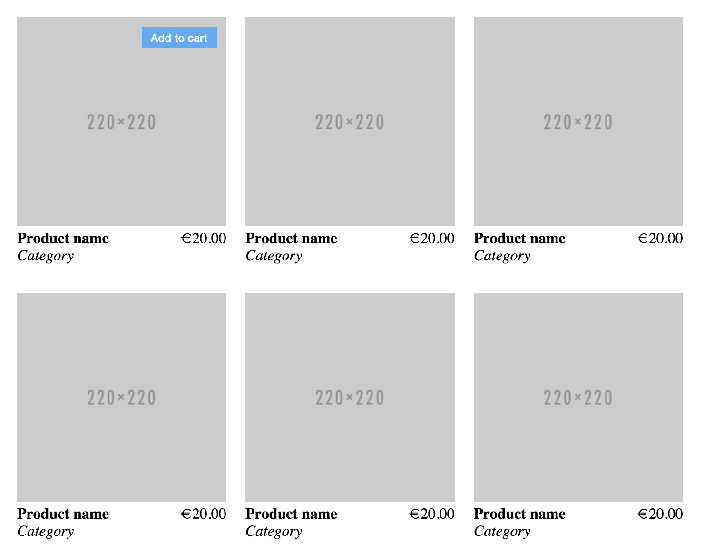

# Products grid
---

Create a web page with a grid of products, for an online store, using HTML and CSS.

Details:
- Grid
  - Using flex
  - Grid item width: 220px
- Product
  - Image
  - Name
  - Category
  - Price
  - Add to cart button
    - Visible only when hovering the product
    - Positioned on the top-right corner of the product image

Starting html:
```html
<!DOCTYPE html>
<html>
  <head>
    <meta charset="utf-8">
    <link rel="stylesheet" type="text/css" href="styles.css">
  </head>
  <body>
    <div class="products-container">
      <div id="products-grid">
      </div>
    </div>
  </body>
</html>
```

Starting css:
```css
.products-container {
  width: 720px;
}
```


Preview:


